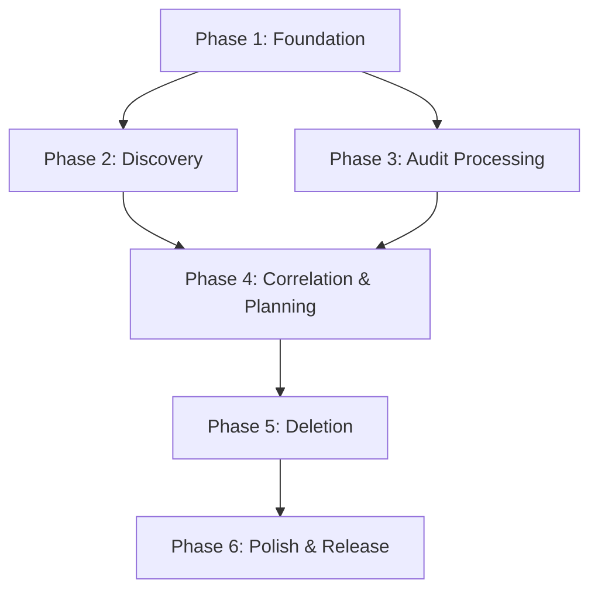

# Vault Secrets Cleanup - Master Implementation Plan

> **For agentic workers:** Each phase has a dedicated plan document. Use superpowers:subagent-driven-development or superpowers:executing-plans to implement each phase's plan task-by-task.

**Goal:** Build a production-ready Go CLI tool for identifying and removing stale secrets from HashiCorp Vault Enterprise based on audit log analysis.

**Architecture:** Modular design with clear separation between discovery, analysis, planning, and execution. Uses Protocol Buffers for efficient data storage, streaming for large-scale processing, and comprehensive safety features.

**Tech Stack:** Go 1.21+, Cobra/Viper (CLI), Vault Go SDK, Protocol Buffers, streaming JSON parser

---

## Overview

This master plan breaks down the Vault Secrets Cleanup implementation into 6 phases, each with its own detailed plan document. Each phase produces working, testable software that can be validated independently.

## Phase Structure

### Phase 1: Foundation (Weeks 1-2)
**Plan:** [`2026-04-10-phase1-foundation.md`](2026-04-10-phase1-foundation.md)

**Deliverables:**
- CLI framework with cobra/viper
- Configuration management (YAML + env vars + flags)
- Vault client wrapper with authentication
- Rate limiter with adaptive throttling
- Retry logic with exponential backoff
- Structured logging infrastructure
- Basic unit tests

**Success Criteria:**
- CLI can parse commands and flags
- Configuration loads from multiple sources with correct precedence
- Vault client authenticates and handles token renewal
- Rate limiter prevents API overload
- Retry logic handles transient failures

---

### Phase 2: Discovery (Weeks 3-4)
**Plan:** [`2026-04-10-phase2-discovery.md`](2026-04-10-phase2-discovery.md)

**Deliverables:**
- Namespace enumeration (recursive)
- KV mount discovery per namespace
- Secret path enumeration (streaming)
- Protocol Buffer schema for inventory
- Inventory export to `.pb` files
- Progress tracking with ETA
- Integration tests with test Vault

**Success Criteria:**
- Discovers 100k+ secrets across namespaces
- Handles permission boundaries gracefully
- Exports inventory in efficient binary format
- Memory usage <200MB for large inventories

---

### Phase 3: Audit Processing (Weeks 5-7)
**Plan:** [`2026-04-10-phase3-audit-processing.md`](2026-04-10-phase3-audit-processing.md)

**Deliverables:**
- Streaming JSON audit log parser
- Access event extraction (read/write/delete)
- Protocol Buffer schema for access data
- Multi-file processing with merge
- Compression support (gzip, bzip2, xz)
- External access data import
- Performance optimization for 10GB+ logs

**Success Criteria:**
- Processes 10GB audit log in <30 minutes
- Memory usage <500MB during processing
- Correctly extracts KV v1 and v2 access events
- Handles compressed and multi-file logs

---

### Phase 4: Correlation & Planning (Weeks 8-9)
**Plan:** [`2026-04-10-phase4-correlation-planning.md`](2026-04-10-phase4-correlation-planning.md)

**Deliverables:**
- Inventory-access correlation engine
- Configurable matching strategies (strict/path-based)
- Staleness calculation with per-namespace rules
- Exclusion rules engine (glob patterns)
- Protocol Buffer schema for deletion plans
- Plan generation with categorization
- Report generation (JSON, Markdown, CSV)

**Success Criteria:**
- Accurately correlates inventory with access data
- Applies staleness criteria correctly
- Respects exclusion rules
- Generates reviewable deletion plans

---

### Phase 5: Deletion (Weeks 10-11)
**Plan:** [`2026-04-10-phase5-deletion.md`](2026-04-10-phase5-deletion.md)

**Deliverables:**
- Deletion execution engine
- KV v1 and v2 hard delete support
- Circuit breaker for failure handling
- Plan status tracking (pending/deleted/failed)
- Resumable operations with checkpoints
- Confirmation prompts and dry-run mode
- Progress tracking with real-time updates

**Success Criteria:**
- Safely deletes secrets according to plan
- Handles both KV v1 and v2 semantics
- Stops on excessive failures (circuit breaker)
- Allows resumption after interruption
- Updates plan file with deletion status

---

### Phase 6: Polish & Release (Weeks 12-13)
**Plan:** [`2026-04-10-phase6-polish-release.md`](2026-04-10-phase6-polish-release.md)

**Deliverables:**
- End-to-end integration tests
- Performance benchmarks and optimization
- Security audit and hardening
- Comprehensive documentation
- Example configurations and workflows
- CI/CD pipeline setup
- Release artifacts (v1.0.0)

**Success Criteria:**
- All functional requirements met
- Performance targets achieved
- Security best practices followed
- Documentation complete and clear
- Ready for production use

---

## Implementation Strategy

### Context Window Management

Each phase plan is designed to fit within a reasonable context window:
- **Phase plans**: 500-800 lines each
- **Task granularity**: 2-5 minute actions
- **File focus**: Small, single-responsibility files
- **Code examples**: Complete, no placeholders

### Execution Approach

**Recommended:** Use subagent-driven-development for each phase:
1. Load phase plan
2. Dispatch fresh subagent per task
3. Review between tasks
4. Fast iteration with focused context

**Alternative:** Use executing-plans for batch execution with checkpoints

### Testing Strategy

- **Unit tests**: Per component, written TDD-style
- **Integration tests**: Per phase, with test Vault
- **E2E tests**: Full workflow validation
- **Performance tests**: Large-scale scenarios

### Dependencies Between Phases



- Phase 1 must complete before Phase 2 or 3
- Phase 4 requires both Phase 2 and 3
- Phase 5 requires Phase 4
- Phase 6 integrates all previous phases

### File Structure

```
vault-secrets-cleanup/
├── cmd/
│   └── vault-secrets-cleanup/
│       └── main.go
├── internal/
│   ├── cli/              # Phase 1: CLI commands
│   ├── config/           # Phase 1: Configuration
│   ├── vault/            # Phase 1: Vault client
│   ├── ratelimit/        # Phase 1: Rate limiting
│   ├── retry/            # Phase 1: Retry logic
│   ├── discovery/        # Phase 2: Discovery engine
│   ├── audit/            # Phase 3: Audit processing
│   ├── correlation/      # Phase 4: Correlation engine
│   ├── planning/         # Phase 4: Plan generation
│   ├── deletion/         # Phase 5: Deletion engine
│   └── reporting/        # Phase 4: Report generation
├── pkg/
│   └── proto/            # Protocol Buffer definitions
├── docs/
│   ├── superpowers/
│   │   └── plans/        # Implementation plans
│   └── examples/         # Example configs and workflows
├── tests/
│   ├── integration/      # Integration tests
│   └── e2e/              # End-to-end tests
├── .pre-commit-config.yaml
├── go.mod
├── go.sum
├── Makefile
└── README.md
```

---

## Getting Started

1. **Review this master plan** and all phase plans
2. **Start with Phase 1**: Foundation is prerequisite for all other phases
3. **Use subagent-driven-development**: Dispatch fresh subagent per task for best results
4. **Test incrementally**: Validate each phase before moving to next
5. **Commit frequently**: Small, focused commits per task

## Success Metrics

- **Functional**: All requirements from REQUIREMENTS.md implemented
- **Performance**: 10GB audit log in <30 minutes, <500MB memory
- **Reliability**: <1% error rate, resumable operations
- **Security**: Secure credential handling, permission validation
- **Usability**: Clear CLI, comprehensive docs, helpful error messages

---

**Next Step:** Begin with Phase 1 by loading [`2026-04-10-phase1-foundation.md`](2026-04-10-phase1-foundation.md)